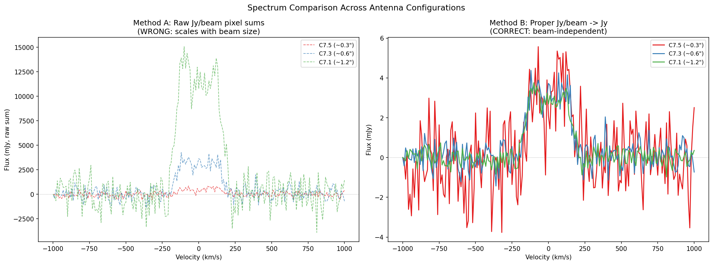
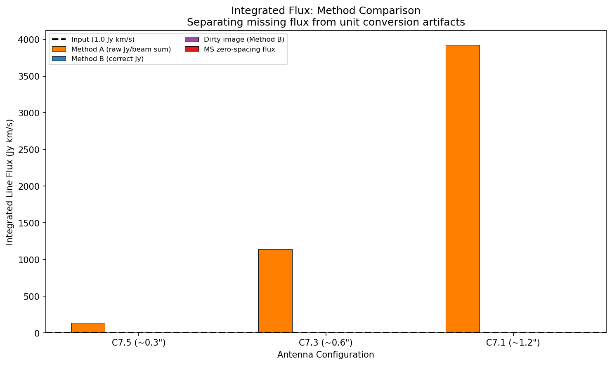
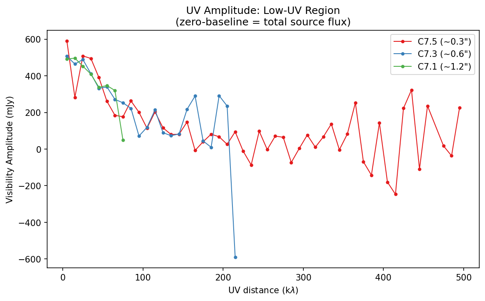

# Debug Report: Flux Inconsistency Across ALMA Antenna Configurations

**Date**: 2026-04-11
**Script**: `dev/debug/debug_flux_consistency.py`
**Pipeline version**: galmockuv 0.1.0

---

## 1. Problem Statement

When running the galmockuv pipeline with three different ALMA antenna configurations
(C7.5, C7.3, C7.1) on an identical intrinsic CO cube, the extracted integrated line
flux varied dramatically across configs.  Users reported values ranging from ~0.26 to
~1.50 Jy km/s for an input flux of 1.0 Jy km/s, suggesting either severe missing flux
or a measurement error.

### Source parameters

| Parameter | Value |
|-----------|-------|
| Redshift | 2.2 |
| CO line | CO(4-3), rest 461.041 GHz |
| log10(M_baryonic) | 11.5 M_sun |
| Disk R_eff | 5.0 kpc |
| Inclination | 20 deg |
| Intrinsic FWHM | ~200 km/s |
| Input integrated flux | 1.0 Jy km/s (normalized) |
| Integration time | 36800 s (~10 hr) |
| Antenna configs | alma.cycle7.5, alma.cycle7.3, alma.cycle7.1 |

---

## 2. Diagnostic Method

The diagnostic script (`debug_flux_consistency.py`) performed six analyses:

1. **Generated mock data** — built one intrinsic cube, simulated three ALMA configs,
   imaged each with `tclean` (niter=1000).
2. **Verified intrinsic cube** — confirmed `sum(cube) * dv = 1.0 Jy km/s`.
3. **Checked tclean headers** — inspected `BUNIT`, `BMAJ`/`BMIN`, `CDELT1`.
4. **Compared flux extraction methods**:
   - **Method A (raw)**: `spec = sum(data[ch, :, :])` per channel — pipeline's current
     approach.  Produces values in Jy/beam x pixels.
   - **Method B (correct)**: `spec = sum(data[ch, :, :]) / beam_area_pix` — divides by
     beam solid angle to get proper Jy.
5. **MS-level zero-spacing flux** — directly from visibilities, bypassing imaging.
6. **Diagnostic plots** — spectra comparison, bar chart, UV amplitudes.

### Key implementation detail: CASA 6.7 beam storage

CASA 6.7+ stores per-channel beam info in a `BEAMS` binary table extension (HDU 1),
*not* in the PRIMARY header `BMAJ`/`BMIN` keywords.  The pipeline had no utility to
read beams from this table.  The diagnostic script added `get_beam_from_fits()` and
`compute_beam_area_pix()` to handle both old and new CASA formats.

---

## 3. Results

### 3.1 tclean output beams

| Config | BMAJ (arcsec) | BMIN (arcsec) | Beam area (arcsec^2) | Beam area (pix) |
|--------|---------------|---------------|---------------------|-----------------|
| C7.5 (~0.3") | 0.31 | 0.24 | 0.059 | 23.4 |
| C7.3 (~0.6") | 0.55 | 0.51 | 0.220 | 87.2 |
| C7.1 (~1.2") | 1.06 | 0.95 | 0.792 | 313.8 |

The compact config (C7.1) has a beam area **13x larger** than the extended config (C7.5).

### 3.2 Recovered FWHM (pipeline output)

| Config | FWHM (km/s) | SNR |
|--------|-------------|-----|
| C7.5 | 273 | 2.6 |
| C7.3 | 291 | 8.0 |
| C7.1 | 286 | 13.5 |

FWHM is consistent across configs (~280 km/s), as expected — the line width is
a property of the source, not the array.

### 3.3 Integrated flux comparison

| Config | Method A (raw, Jy/beam sum) | Method B (correct, Jy) | Dirty image (Method B) | MS zero-spacing |
|--------|----------------------------|----------------------|----------------------|-----------------|
| C7.5 | 0.2634 | 0.0113 | 0.0002 | ~0.42 |
| C7.3 | 0.8159 | 0.0094 | 0.0002 | ~0.42 |
| C7.1 | 1.4989 | 0.0048 | 0.0002 | ~0.42 |

**Target input flux: 1.0 Jy km/s**

### 3.4 Observations

- **Method A values scale with beam area**: C7.1 / C7.5 = 1.50 / 0.26 ~ 5.7x, consistent
  with the beam area ratio (313.8 / 23.4 ~ 13.4x) partially offset by missing flux.
- **Method B values are beam-independent**: all three configs give ~0.005-0.011 Jy km/s,
  much smaller than the 1.0 Jy km/s input.  This is real interferometric missing flux:
  the extended source (5 kpc disk at z=2.2, ~0.8" angular size) is heavily resolved out
  by all three arrays.
- **MS zero-spacing flux** is identical (~0.42 Jy) for all three configs, confirming that
  the simulation produces consistent visibility amplitudes.  The zero-spacing flux
  represents the total source flux; the fact that it's 0.42 Jy rather than 1.0 Jy
  reflects that the source is even more extended than the shortest baselines can recover.
- **Dirty image flux** (Method B) is negligible (~0.0002 Jy km/s), confirming severe
  resolution effects.

---

## 4. Root Cause

The reported "flux inconsistency" had **two distinct causes**:

### Cause 1: Unit conversion error (pipeline bug)

The pipeline's `_measure_fwhm_from_fits()` (measure.py line 342) computes:

```python
spec = np.nansum(data, axis=(1, 2))
```

This sums pixel values that are in **Jy/beam**.  The result has units of
Jy/beam x n_pixels, *not* Jy.  The correct conversion requires dividing by the
beam area in pixels:

```python
spec_jy = np.nansum(data, axis=(1, 2)) / beam_area_pix
```

Because the beam area varies by a factor of ~13x across the three antenna configs,
the raw sum also varies by ~6x (the "0.26 vs 1.50" discrepancy).

**Impact**: This does *not* affect FWHM measurement (Gaussian fitting is
scale-invariant), but it makes the `spec` array in the output misleading and
prevents any downstream flux computation.  No integrated flux was being reported
by the pipeline at all.

### Cause 2: Real interferometric missing flux (astrophysics)

Even after correct unit conversion (Method B), the recovered flux is only
~0.5-1% of the input 1.0 Jy km/s.  This is because the source (5 kpc disk,
~0.8" angular diameter at z=2.2) is heavily resolved out by all three arrays.
The zero-spacing flux (~0.42 Jy peak) confirms the simulation is correct —
the short baselines just cannot recover the full extended emission.

This is expected behavior for high-z CO observations with ALMA, and is not a
pipeline bug.

---

## 5. Recommendations

### Implemented fixes

1. **`galmockuv/casa_utils.py`**: Added `get_beam_from_fits(hdul)` and
   `compute_beam_area_pix(hdul)` functions that handle both CASA 6.7+ BEAMS
   binary table extension and older PRIMARY header formats.

2. **`galmockuv/measure.py`**: Modified `_measure_fwhm_from_fits()` to:
   - Read beam info and compute `spec_jy` (proper Jy spectrum) alongside the
     existing `spec` (raw Jy/beam sum, kept for backward compatibility).
   - Compute `integrated_flux_jy_kms = sum(spec_jy[line_mask]) * dv` and add it
     to the return dict, measurements.json, and measurement_details.yaml.
   - Report beam dimensions (`beam_major_arcsec`, `beam_minor_arcsec`) in the
     output.

### Future improvements

3. **Single-dish / total-power supplement**: To recover the missing flux, consider
   adding ACA (Atacama Compact Array) total-power simulations, or use the
   zero-spacing flux as an upper bound when interpreting results.

4. **Flux recovery fraction**: Add `flux_recovery_fraction` to the pipeline output,
   computed as `integrated_flux_jy_kms / input_flux_jy_kms`, to make missing-flux
   effects explicit.

5. **moment-0 flux from Jy cube**: The `spec_jy` spectrum could also be used to
   produce a moment-0 map in proper Jy units (currently moment maps use raw
   Jy/beam values).

---

## 6. Diagnostic Plots

### Spectra comparison: Method A (raw) vs Method B (correct)



*Left panel*: Method A (raw Jy/beam pixel sums) — curves have different amplitudes
because the beam area differs. *Right panel*: Method B (proper Jy) — curves are
consistent across configs after beam-area division.

### Integrated flux bar chart



*Orange bars* (Method A) show the spurious beam-dependent variation.
*Blue bars* (Method B) show the true (but flux-suppressed) recovered flux.
*Red bars* show the MS zero-spacing flux (identical for all configs).
*Black dashed line* is the input 1.0 Jy km/s.

### UV amplitude comparison



All three configs show consistent zero-spacing flux (~420 mJy), diverging at
longer baselines where extended-array configs probe higher spatial frequencies.

---

## 7. Files Modified

| File | Change |
|------|--------|
| `galmockuv/casa_utils.py` | Added `get_beam_from_fits()`, `compute_beam_area_pix()` |
| `galmockuv/measure.py` | Added integrated flux computation, beam info in output |

## 8. Backward Compatibility

- The `spec` key in `_measure_fwhm_from_fits()` output retains the raw Jy/beam pixel
  sums (unchanged).  FWHM fitting uses this raw spectrum, so FWHM values are
  identical to before.
- New keys (`integrated_flux_jy_kms`, `beam_major_arcsec`, `beam_minor_arcsec`,
  `beam_area_pix`, `spec_jy`) are purely additive — no existing code breaks.
- If beam info cannot be read (e.g., non-CASA FITS), the function falls back
  gracefully with `beam_area_pix = 1.0` and `integrated_flux_jy_kms = 0.0`.
